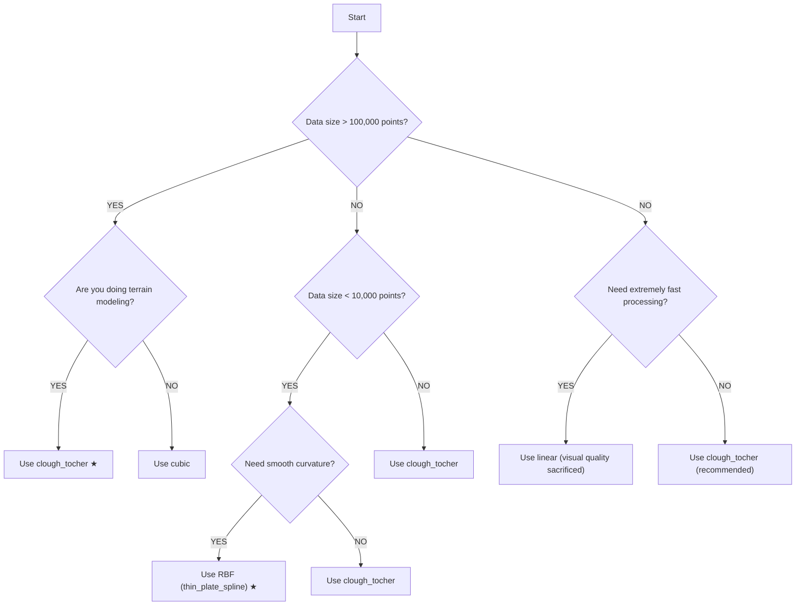

# Interpolation Methods Reference Guide

This document provides a detailed overview of the interpolation methods available in this splicing tool, including their mathematical formulations, practical use cases, advantages, and limitations.

---

## 1. Linear Interpolation

**Continuity:** C⁰ (Position continuous, first derivative discontinuous)

### Mathematical Expression

For a point $(x, y)$ within a grid cell defined by four corners $(x_1,y_1)$, $(x_2,y_1)$, $(x_1,y_2)$, $(x_2,y_2)$ with known values $z_{11}, z_{21}, z_{12}, z_{22}$:

$$z(x,y) = \frac{z_{11}(x_2-x)(y_2-y) + z_{21}(x-x_1)(y_2-y) + z_{12}(x_2-x)(y-y_1) + z_{22}(x-x_1)(y-y_1)}{(x_2-x_1)(y_2-y_1)}$$

Alternatively, bilinear interpolation can be expressed as:

$$z(x,y) = a + bx + cy + dxy$$

where coefficients $a, b, c, d$ are solved from the four corner constraints.

### Characteristics

| Aspect | Description |
|--------|-------------|
| **Speed** | ⚡ Fastest (simple arithmetic operations) |
| **Smoothness** | Creates piecewise planar facets with visible creases at cell boundaries |
| **Memory** | Low memory footprint |
| **Best For** | Quick previews, non-critical visualizations, or when speed is paramount |
| **Worst For** | Applications requiring smooth gradients or aesthetic visual quality |

### Pros & Cons

| Pros | Cons |
|------|------|
| ✅ Extremely fast computation | ❌ C⁰ continuity only — creases at grid boundaries |
| ✅ No artifacts (overshoot/ringing) | ❌ Discontinuous first derivative |
| ✅ Simple to understand and implement | ❌ Poor visual quality for terrain/surface rendering |
| ✅ Guaranteed to stay within data range | ❌ Not suitable for physical simulations |

### Example Use Case
- Quick data preview in interactive exploration
- Low-resolution DEM visualization
- Real-time applications with large datasets

---

## 2. Cubic Interpolation (via `scipy.interpolate.griddata`)

**Continuity:** C¹ (First derivative continuous, second derivative discontinuous)

### Mathematical Expression

Piecewise cubic interpolation on a structured grid using the **bicubic** formulation:

$$z(x,y) = \sum_{i=0}^{3} \sum_{j=0}^{3} a_{ij} x^i y^j$$

The 16 coefficients $a_{ij}$ are determined by:

1. Values at four corners: $z_{11}, z_{21}, z_{12}, z_{22}$
2. Partial derivatives at corners: $\frac{\partial z}{\partial x}$, $\frac{\partial z}{\partial y}$
3. Cross derivatives at corners: $\frac{\partial^2 z}{\partial x \partial y}$

The derivatives are estimated from neighboring grid points using finite differences.

### Characteristics

| Aspect | Description |
|--------|-------------|
| **Speed** | 🏃 Fast (griddata is optimized for structured data) |
| **Smoothness** | Smooth surfaces with continuous first derivatives |
| **Memory** | Moderate memory footprint |
| **Best For** | General-purpose gridded data interpolation |
| **Worst For** | Irregular boundaries (creates extrapolation artifacts) |

### Pros & Cons

| Pros | Cons |
|------|------|
| ✅ C¹ continuous — smooth visual appearance | ❌ Can produce overshoots/ringing artifacts |
| ✅ Fast computation for gridded data | ❌ Less smooth than Clough-Tocher or RBF |
| ✅ Robust and widely tested implementation | ❌ May extrapolate poorly at boundaries |
| ✅ No triangulation overhead | ❌ Structured grid assumption may not fit all data |

### Example Use Case
- Remote sensing image resampling
- Elevation data interpolation for mapping
- General scientific data processing

---

## 3. Clough-Tocher Interpolation

**Continuity:** C¹ (First derivative continuous, based on triangular subdivision)

### Mathematical Expression

For each triangular element with vertices $\mathbf{v}_1, \mathbf{v}_2, \mathbf{v}_3$, the interpolation is performed in **barycentric coordinates** $(\lambda_1, \lambda_2, \lambda_3)$ where $\lambda_1 + \lambda_2 + \lambda_3 = 1$:

$$z(\lambda_1, \lambda_2, \lambda_3) = \sum_{i=1}^{3} z_i \lambda_i + \sum_{i=1}^{3} \left[ \alpha_i \lambda_i^2 \lambda_j + \beta_i \lambda_i \lambda_j^2 \right] + \gamma \lambda_1 \lambda_2 \lambda_3$$

The coefficients $\alpha_i, \beta_i, \gamma$ are chosen to ensure:
- Interpolation at vertices: $z(\mathbf{v}_i) = z_i$
- Derivative matching at vertices: $\nabla z(\mathbf{v}_i) = \nabla z_i$
- Continuity of derivatives across triangle edges

The method uses **cubic Hermite interpolation** on each triangular patch, with derivatives estimated from neighboring triangles.

### Characteristics

| Aspect | Description |
|--------|-------------|
| **Speed** | 🐇 Fast (triangulation O(N log N), patch evaluation O(1)) |
| **Smoothness** | C¹ continuous with smooth gradients across triangle boundaries |
| **Memory** | Moderate (requires triangulation storage) |
| **Best For** | **Recommended** — irregular boundaries, balanced performance |
| **Worst For** | Extremely dense point clouds (triangulation overhead) |

### Pros & Cons

| Pros | Cons |
|------|------|
| ✅ C¹ continuous — smooth and visually appealing | ❌ Requires Delaunay triangulation (overhead) |
| ✅ Handles irregular boundaries naturally | ❌ Can produce slight artifacts near steep gradients |
| ✅ Good balance of speed and smoothness | ❌ More complex than simple linear/cubic methods |
| ✅ No extrapolation beyond convex hull | ❌ Memory usage grows with point count |
| ✅ No overshoot artifacts (derivative-limited) | |

### Example Use Case
- **Recommended starting parameter** for terrain interpolation
- DEM generation from scattered survey points
- Environmental data (temperature, precipitation) interpolation
- Geographic Information Systems (GIS)

---

## 4. RBF (Radial Basis Function) — Cubic Kernel

**Continuity:** C∞ (Infinitely differentiable)

### Mathematical Expression

For $N$ data points $(\mathbf{x}_i, z_i)$:

$$z(\mathbf{x}) = \sum_{i=1}^{N} w_i \phi(\|\mathbf{x} - \mathbf{x}_i\|) + p(\mathbf{x})$$

where:
- $\phi(r)$ is the radial basis function (kernel)
- $w_i$ are weights to be determined
- $p(\mathbf{x})$ is a linear polynomial trend term

**Cubic kernel:**
$$\phi(r) = r^3$$

The weights $w_i$ are solved from the linear system:

$$\begin{bmatrix} \Phi & \mathbf{P} \\ \mathbf{P}^T & 0 \end{bmatrix} \begin{bmatrix} \mathbf{w} \\ \mathbf{c} \end{bmatrix} = \begin{bmatrix} \mathbf{z} \\ 0 \end{bmatrix}$$

where $\Phi_{ij} = \phi(\|\mathbf{x}_i - \mathbf{x}_j\|)$ and $\mathbf{P}$ contains polynomial basis terms.

### RBF Kernel Options

| Kernel | Formula | Smoothness | Characteristics |
|--------|---------|------------|-----------------|
| **Cubic** | $\phi(r) = r^3$ | C² | Smooth, computationally moderate |
| **Thin Plate Spline** | $\phi(r) = r^2 \ln(r)$ | C² | Minimal bending energy, smooth |
| **Gaussian** | $\phi(r) = e^{-(\varepsilon r)^2}$ | C∞ | Very smooth, parameter-sensitive |

### Characteristics

| Aspect | Description |
|--------|-------------|
| **Speed** | 🐌 **Very slow** (O(N³) solver, O(N²) storage) |
| **Smoothness** | C∞ — extremely smooth surfaces |
| **Memory** | High (N×N matrix storage required) |
| **Best For** | Small datasets (< 5000 points), high-quality smooth surfaces |
| **Worst For** | Large datasets (> 50,000 points) — NOT recommended |

### Pros & Cons

| Pros | Cons |
|------|------|
| ✅ C∞ continuous — infinitely smooth | ❌ **Very slow** for large datasets |
| ✅ No derivative discontinuities | ❌ Memory-intensive (N² storage) |
| ✅ Excellent interpolation quality | ❌ Sensitive to parameter tuning (epsilon) |
| ✅ Handles scattered data naturally | ❌ Can overshoot near steep gradients |

### Example Use Case
- High-quality surface reconstruction (e.g., museum artifacts)
- Small-scale geophysical modeling
- Scientific visualization requiring smooth isosurfaces

---

## 5. Thin Plate Spline (RBF variant)

**Continuity:** C² (Second derivative continuous)

### Mathematical Expression

Minimizes the **bending energy** functional:

$$\mathcal{E}(z) = \iint \left[ \left(\frac{\partial^2 z}{\partial x^2}\right)^2 + 2\left(\frac{\partial^2 z}{\partial x \partial y}\right)^2 + \left(\frac{\partial^2 z}{\partial y^2}\right)^2 \right] dx\,dy$$

The solution is:

$$z(\mathbf{x}) = \sum_{i=1}^{N} w_i \phi(\|\mathbf{x} - \mathbf{x}_i\|) + a_0 + a_1 x + a_2 y$$

where $\phi(r) = r^2 \ln(r)$ for 2D problems.

This formulation produces the **smoothest possible surface** (minimum curvature) that passes through the data points.

### Characteristics

| Aspect | Description |
|--------|-------------|
| **Speed** | 🐌 Very slow (similar to RBF) |
| **Smoothness** | C² — second derivative continuous |
| **Memory** | High (N×N matrix) |
| **Best For** | Terrain data, geophysical surfaces |
| **Worst For** | Large datasets, real-time applications |

### Pros & Cons

| Pros | Cons |
|------|------|
| ✅ C² continuous — smooth curvature | ❌ Computationally expensive (same as RBF) |
| ✅ Minimizes bending energy (most "natural" surface) | ❌ Requires solving large linear system |
| ✅ Perfect for terrain/first-order surfaces | ❌ Sensitive to outliers |
| ✅ Handles scattered data well | ❌ Memory O(N²) |

### Example Use Case
- **Terrain modeling** (recommended for topography)
- Geological surface reconstruction
- Contour generation from scattered elevation points

---

## Comparison Summary Table

| Method | Continuity | Speed | Smoothness | Memory | Boundary Handling | Recommended |
|--------|------------|-------|------------|--------|-------------------|-------------|
| **Linear** | C⁰ | ⚡⚡⚡⚡⚡ | Poor | Low | Good | ❌ Not for production |
| **Cubic** | C¹ | ⚡⚡⚡⚡ | Good | Low | Moderate | ✅ Good fallback |
| **Clough-Tocher** | C¹ | ⚡⚡⚡ | Very Good | Moderate | Excellent | ✅ **Recommended** |
| **RBF (Cubic)** | C∞ | ⚡ | Excellent | High | Good | ⚠️ Only for small datasets |
| **Thin Plate Spline** | C² | ⚡ | Excellent | High | Good | ⚠️ Only for small terrain datasets |

---

## Parameter Selection Guide (dig_and_fill.py)

### For `GAP_PADDING` (splicing strip width)

| Padding (pixels) | Distance (grid=300m) | Use Case |
|------------------|---------------------|----------|
| **3** | 0.9 km | Narrow band, minimal overlap, fastest |
| **5** | 1.5 km | Medium band, good for testing |
| **10** | 3.0 km | **Recommended starting parameter** |
| **20** | 6.0 km | Broad band, smooth transitions, slower |

**Rule of thumb:** Start with 10 pixels, increase if visible seams persist, decrease if processing is too slow.

### For `INTERP_METHOD`

| Use Case | Recommended Method |
|----------|-------------------|
| **General purpose (most data)** | `clough_tocher` |
| **Gridded data, fast processing** | `cubic` |
| **Quick preview/draft** | `linear` |
| **High-quality small datasets** | `rbf` |
| **Terrain/topographic data** | `thin_plate_spline` (via RBF) |

### For `PROGRESS_INTERVAL`

- **200,000 points** — Good balance for most datasets
- **50,000** — For detailed progress tracking (more frequent output)
- **1,000,000** — For very large datasets (less console clutter)

---

## Algorithm Selection Decision Tree

---

## Quick Reference Card

```python
# Recommended configuration for most users:
GAP_PADDING = 10                 # 3.0 km overlap
INTERP_METHOD = 'clough_tocher'  # Best balance
PROGRESS_INTERVAL = 200000

# For terrain data (small dataset):
INTERP_METHOD = 'rbf'
RBF_KERNEL = 'thin_plate_spline'
RBF_EPSILON = 2.0

# For speed-critical applications:
INTERP_METHOD = 'cubic'   # or 'linear' for fastest
GAP_PADDING = 3           # Minimal overlap  
```
## Main Reference


